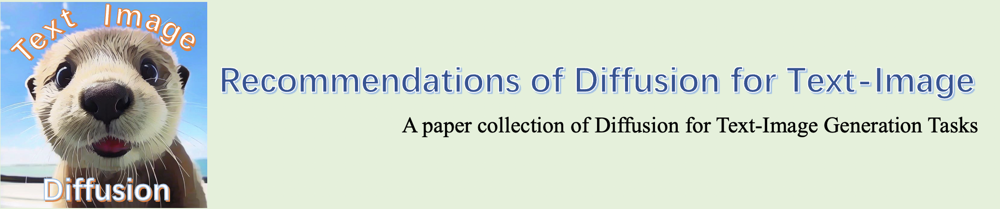

# Recommendations of Diffusion for Text-Image
This repository contains a paper collection of recent diffusion models for text-image generation tasks.

## 📖 Table of Contents 👀
- [Font Generation](#font-generation)
- [Text-to-Image (Visual Text Generation)](#text-to-image-visual-text-generation)
- [Artistic Font Generation](#artistic-font-generation)
- [Text-Image Removal](#text-image-removal)
- [Text-Image Super Resolution](#text-image-super-resolution)
- [Text-Image Editing](#text-image-editing)
- [Inpainting](#inpainting)
- [Handwritten Generation](#handwritten-generation)
- [Scene Text Recognition](#scene-text-recognition)
- [Scene Text Detection](#scene-text-detection)
##

### Font Generation
+ [DiffCJK: Conditional Diffusion Model for High-Quality and Wide-coverage CJK
Character Generation](https://arxiv.org/abs/2404.05212) (Apr. 2024)  
  

+ [VecFusion: Vector Font Generation with Diffusion](https://arxiv.org/abs/2312.10540) (CVPR2024)  
  

+ [Font Style Interpolation with Diffusion Models](https://arxiv.org/abs/2402.14311) (Fec., 2024)  
  

+ 🔥🔥🔥 [FontDiffuser: One-Shot Font Generation via Denoising Diffusion with Multi-Scale Content Aggregation and Style Contrastive Learning](https://arxiv.org/abs/2312.12142) (AAAI2024)  
  
  
  
  

+ [Diff-Font: Diffusion Model for Robust One-Shot Font Generation](https://arxiv.org/abs/2212.05895) (Dec., 2022)  
  
  

### Text-to-Image (Visual Text Generation)
+ [GlyphDraw2: Automatic Generation of Complex Glyph Posters with Diffusion Models and Large Language Models](https://arxiv.org/abs/2407.02252) (Jul, 2024)  
  
  

+ [Glyph-ByT5-v2: A Strong Aesthetic Baseline for Accurate Multilingual Visual Text Rendering](https://arxiv.org/abs/2406.10208) (Jul, 2024)  
  
  
  

+ [High Fidelity Scene Text Synthesis](https://arxiv.org/abs/2405.14701) (Dec, 2023)  
  
  

+ [Glyph-ByT5: A Customized Text Encoder for Accurate Visual Text Rendering](https://arxiv.org/abs/2403.09622) (Mar, 2024)  
  
  

+ [Brush Your Text: Synthesize Any Scene Text on Images via Diffusion Model](https://arxiv.org/abs/2312.12232) (Dec, 2023)  
  
  

+ [UDiffText: A Unified Framework for High-quality Text Synthesis in Arbitrary Images via Character-aware Diffusion Models](https://arxiv.org/abs/2312.04884) (Dec, 2023)  
  
  
  
  

+ [TextDiffuser-2: Unleashing the Power of Language Models for Text Rendering](https://arxiv.org/abs/2311.16465v1) (Nov, 2023)  
  
  
  
  

+ [ANYTEXT: MULTILINGUAL VISUAL TEXT GENERATION AND EDITING](https://arxiv.org/abs/2311.03054) (Nov, 2023)  
  
  

+ [TextDiffuser: Diffusion Models as Text Painters](https://arxiv.org/abs/2305.10855) (May, 2023)  
  
  
  
  

+ [GlyphControl: Glyph Conditional Control for Visual Text Generation](https://arxiv.org/abs/2305.18259) (May, 2023)  
  
  
  

+ [IF](https://github.com/deep-floyd/IF) (Apr., 2023)  
  
  

+ [GlyphDraw: Seamlessly Rendering Text with Intricate Spatial Structures in Text-to-Image Generation](https://arxiv.org/abs/2303.17870) (Mar., 2023)  
  
  
  

+ [Character-aware models improve visual text rendering](https://arxiv.org/abs/2212.10562) (Dec., 2022)  
  

+ [eDiff-I: Text-to-Image Diffusion Models with an Ensemble of Expert Denoisers](https://arxiv.org/abs/2211.01324) (Nov., 2022)  
  
  

+ [Photorealistic Text-to-Image Diffusion Models with Deep Language Understanding](https://arxiv.org/abs/2205.11487) (May, 2022)  
  
  

### Artistic Font Generation
+ [Word-As-Image for Semantic Typography](https://arxiv.org/abs/2303.01818) (SIGGRAPH2023)

  
  
  

+ [ControlNet on Text Effect](https://mp.weixin.qq.com/s/rvpU4XhToldoec_bABeXJw) (Jul., 2023)

+ [DS-Fusion: Artistic Typography via Discriminated and Stylized Diffusion](https://arxiv.org/abs/2303.09604) (ICCV2023)  
  
  
  
  

### Text-Image Removal
+ [Optical Character Recognition with Segment Anything (OCR-SAM)](https://github.com/yeungchenwa/OCR-SAM) (Apr. 2023)  
  

### Text-Image Super Resolution
+ [Diffusion-based Blind Text Image Super-Resolution](https://arxiv.org/abs/2312.08886) (CVPR2024)  
  

+ [PEAN: A Diffusion-based Prior-Enhanced Attention Network for
Scene Text Image Super-Resolution](https://arxiv.org/abs/2311.17955) (Nov. 2023)  
  
  

+ [RECOGNITION-GUIDED DIFFUSION MODEL FOR SCENE TEXT IMAGE
SUPER-RESOLUTION](https://arxiv.org/abs/2311.13317) (Nov. 2023)  
  

+ [Scene Text Image Super-resolution based on Text-conditional Diffusion Models](https://arxiv.org/abs/2311.09759) (Nov. 2023)  
  

+ [DiffBIR: Towards Blind Image Restoration with Generative Diffusion Prior](https://arxiv.org/abs/2308.15070) (Aug. 2023)  
  
  
  

+ [TextDiff: Mask-Guided Residual Diffusion Models for Scene Text Image Super-Resolution](https://arxiv.org/abs/2308.06743) (Aug., 2023)  
  
  

+ [DocDiff: Document Enhancement via Residual Diffusion Models](https://arxiv.org/abs/2305.03892) (ACMMM2023)  
  
  

+ [STIRER: A Unified Model for Low-Resolution Scene Text Image Recovery and Recognition](https://github.com/zhaominyiz/STIRER) (ACMMM2023)  
  

### Text-Image Editing
+ [On Manipulating Scene Text in the Wild with Diffusion Models](https://arxiv.org/abs/2311.00734) (WACV2024)  
  

+ [DiffUTE: Universal Text Editing Diffusion Model](https://arxiv.org/abs/2305.10825) (May, 2023)  
  
  

+ [Improving Diffusion Models for Scene Text Editing with Dual Encoders](https://arxiv.org/abs/2304.05568) (Apr., 2023)  
  
  

### Inpainting
+ [Text Image Inpainting via Global Structure-Guided Diffusion Models](https://arxiv.org/abs/2401.14832) (AAAI2024)  
  
  

### Handwritten Generation
+ [Conditional Text Image Generation with Diffusion Models](https://arxiv.org/abs/2306.10804) (CVPR2023)  
  

+ [ChiroDiff: Modelling chirographic data with Diffusion Models](https://arxiv.org/abs/2304.03785) (ICLR2023)  
  
  
  

+ [Zero-shot Generation of Training Data with Denoising Diffusion Probabilistic Model for Handwritten Chinese Character Recognition](https://arxiv.org/abs/2305.15660) (May, 2023)  
  

+ [WordStylist: Styled Verbatim Handwritten Text Generation with Latent Diffusion Models](https://arxiv.org/abs/2303.16576) (ICDAR2023)  
  
  

+ [Diffusion models for Handwriting Generation](https://arxiv.org/abs/2011.06704) (Nov., 2020)  
  
  

### Scene Text Recognition
+ [DiffusionSTR: Diffusion Model for Scene Text Recognition](https://arxiv.org/abs/2306.16707) (ICIP2023)  
  
+ [IPAD: Iterative, Parallel, and Diffusion-based
Network for Scene Text Recognition](https://arxiv.org/abs/2312.11923) (TPAMI2023)   
  

### Scene Text Detection
+ [Enhancing Scene Text Detectors with Realistic Text Image Synthesis Using Diffusion
Models](https://arxiv.org/abs/2311.16555) (Nov. 2023)  
  
  
